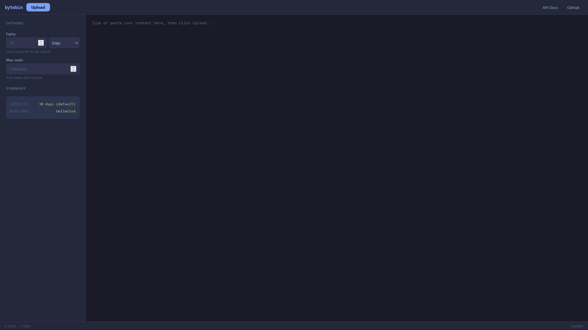

# bytebin

A fast, lightweight content storage service with custom expiry, read limits, and a modern web UI.

**Public instance:** [pastes.paradaux.io](https://pastes.paradaux.io)



## Features

- **Any content type** -- not just plain text. Upload binary data, JSON, images, whatever you want.
- **Custom expiry** -- set a per-upload expiry via the `Bytebin-Expiry` header (value in minutes). Defaults to 30 days for text, 7 days for binary files (max 14 days).
- **Read-limited content** -- set a maximum read count via the `Bytebin-Max-Reads` header. Content is automatically deleted after N reads.
- **Modifiable uploads** -- optionally allow content to be updated via PUT requests with a modification key.
- **Compression** -- content is compressed with gzip to reduce disk usage and network load. Clients can also upload pre-compressed data.
- **Local disk storage** -- content bytes are stored on local disk, separate from the metadata index.
- **PostgreSQL metadata index** -- content metadata is stored in PostgreSQL via MyBatis, enabling horizontal scaling across multiple instances.
- **Modern web UI** -- dark-themed frontend with text and binary file upload, drag-and-drop, sidebar options for expiry and read limits.
- **Content viewer** -- syntax highlighting for code (via highlight.js), inline display for images/video/audio/PDF, and download for binary files at `/view/{key}`.
- **Usage event tracking** -- records API and UI activity to PostgreSQL for analytics.
- **Prometheus metrics** -- built-in metrics endpoint for monitoring storage, request rates, and database performance.
- **CORS support** -- full cross-origin resource sharing for API consumers.

## API

### Read

* `GET /{key}` -- returns the raw stored content directly.
  * If the content was posted using an encoding other than gzip, the requester must also "accept" it.
  * For gzip, bytebin will automatically decompress if the client doesn't support compression.
  * If the content has a read limit, the response includes a `Bytebin-Reads-Remaining` header.

### View

* `GET /view/{key}` -- opens a browser-friendly viewer page.
  * Syntax highlighting for code, inline display for images/video/audio/PDF, download card for binary.
  * Fetches content client-side from `GET /{key}`.

### Write

* `POST /post` -- upload new content. The request body is stored and a unique key is returned.
  * Specify `Content-Type` to control the stored MIME type (defaults to `text/plain`).
  * Ideally, compress content client-side with gzip and include the `Content-Encoding: gzip` header. Bytebin compresses server-side when no encoding is specified.
  * The key is returned in the `Location` response header and in the JSON body: `{"key": "aabbcc"}`.

#### Optional Write Headers

| Header | Type | Description |
|---|---|---|
| `Bytebin-Expiry` | integer | Custom expiry time in **minutes**. Defaults to 30 days for text, 7 days for binary files. Binary uploads are capped at 14 days max. |
| `Bytebin-Max-Reads` | integer | Maximum number of times the content can be read before automatic deletion. |
| `Allow-Modification` | boolean | If `true`, returns a `Modification-Key` header for subsequent PUT updates. |

> **File expiry limits:** Non-text content types (images, video, audio, archives, etc.) default to 7-day expiry and are capped at a 14-day maximum. Text types (`text/*`, `application/json`, `application/xml`, etc.) keep the standard 30-day default.

### Update

* `PUT /{key}` -- update existing content. Only works if the content was created with `Allow-Modification: true`.
  * Requires `Authorization: Bearer <modification-key>` header.
  * Returns `200 OK` on success, `403 Forbidden` if the key is wrong or content is not modifiable, `401 Unauthorized` if the header is missing.

### Health

* `GET /health` -- returns `{"status":"ok"}`. Useful for load balancer health checks.

### Metrics

* `GET /metrics` -- Prometheus scrape endpoint (only accessible without `X-Forwarded-For`, i.e. not through a reverse proxy).

## Self-hosting

### Requirements

- Java 21+
- PostgreSQL 15+

### Docker Compose

```yaml
services:
  postgres:
    image: postgres:17-alpine
    restart: unless-stopped
    environment:
      POSTGRES_DB: bytebin
      POSTGRES_USER: bytebin
      POSTGRES_PASSWORD: bytebin
    volumes:
      - pgdata:/var/lib/postgresql/data
    healthcheck:
      test: ["CMD-SHELL", "pg_isready -U bytebin -d bytebin"]
      interval: 5s
      timeout: 5s
      retries: 5

  bytebin:
    image: harbor.paradaux.io/paradaux-public/bytebin:prod
    ports:
      - 3000:8080
    volumes:
      - data:/opt/bytebin/content
    environment:
      BYTEBIN_DB_HOST: postgres
      BYTEBIN_DB_PORT: 5432
      BYTEBIN_DB_NAME: bytebin
      BYTEBIN_DB_USERNAME: bytebin
      BYTEBIN_DB_PASSWORD: bytebin
    depends_on:
      postgres:
        condition: service_healthy

volumes:
  data: {}
  pgdata: {}
```

```bash
$ docker compose up
```

You should then be able to access the application at `http://localhost:3000/`.

### Development

The included `docker-compose.yml` builds from the local Dockerfile and starts a PostgreSQL instance alongside it. To get a development environment running:

```bash
$ docker compose up --build
```

This will compile the project inside Docker (requires no local JDK) and start bytebin on `http://localhost:8080/` with a PostgreSQL database. The compose file is configured with sensible defaults for local development -- changes to the source just need another `--build`.

#### Project structure

```
me.lucko.bytebin
├── Bytebin.java                    # Entrypoint. Wires up HikariCP, Flyway, MyBatis,
│                                   # storage backends, and the Jooby web server.
├── content/
│   ├── Content.java                # POJO representing a piece of stored content (metadata + bytes).
│   ├── StorageBackendSelector.java # Strategy for choosing which backend to write to.
│   ├── ContentStorageMetric.java   # POJO for aggregate metric query results.
│   ├── DateEpochMillisTypeHandler.java # MyBatis TypeHandler: java.util.Date <-> BIGINT epoch millis.
│   └── storage/
│       ├── StorageBackend.java     # Interface: load, save, delete, list.
│       ├── LocalDiskBackend.java   # Stores content bytes on local disk.
│       └── AuditTask.java          # Reconciles the DB index against storage backends.
├── controller/
│   ├── BytebinServer.java          # Jooby app definition. Registers routes, CORS, error handlers.
│   ├── ContentGetController.java   # GET /{key} -- serves raw content, handles read limits and expiry.
│   ├── ContentPostController.java  # POST /post -- accepts uploads, compresses, saves.
│   ├── ContentUpdateController.java# PUT /{key} -- modifies existing content with auth key.
│   ├── ContentViewController.java  # GET /view/{key} -- serves the HTML viewer page.
│   ├── MetricsController.java      # GET /metrics -- Prometheus scrape endpoint.
│   └── MetricsFilter.java          # Route decorator that records per-request Prometheus metrics.
├── dao/
│   ├── ContentDao.java             # Content data access: wraps MyBatis SqlSessionFactory.
│   ├── ContentMapper.java          # MyBatis mapper interface (Java annotation-based SQL).
│   ├── UsageEventDao.java          # Usage event data access.
│   └── UsageEventMapper.java       # MyBatis mapper for usage events.
├── service/
│   ├── ContentService.java         # Coordinates between the DAO and storage backends.
│   │                               # Implements Caffeine's CacheLoader for async loading.
│   ├── ContentLoader.java          # Caffeine cache layer sitting in front of ContentService.
│   └── UsageEventService.java      # Async batched writer for usage events.
├── usage/
│   └── UsageEvent.java             # POJO with builder for usage event records.
├── ratelimit/
│   ├── RateLimiter.java            # Interface for rate limiting strategies.
│   ├── SimpleRateLimiter.java      # Fixed-window rate limiter (POST, PUT, GET).
│   ├── ExponentialRateLimiter.java # Exponential backoff limiter (404 abuse prevention).
│   └── RateLimitHandler.java       # Extracts client IP, validates API keys, applies rate limits.
├── logging/
│   ├── LogHandler.java             # Interface for request audit logging.
│   ├── HttpLogHandler.java         # Ships audit logs to an external HTTP endpoint.
│   └── AbstractAsyncLogHandler.java# Async batching base class for log handlers.
└── util/
    ├── Configuration.java          # Reads config from JSON file, system properties, or env vars.
    ├── ContentEncoding.java        # Parses Accept-Encoding / Content-Encoding headers.
    ├── EnvVars.java                # Maps BYTEBIN_* env vars to system properties at startup.
    ├── ExceptionHandler.java       # Global uncaught exception handler.
    ├── ExpiryHandler.java          # Computes expiry times, with per-User-Agent overrides.
    ├── Gzip.java                   # Gzip compress/decompress helpers.
    ├── Metrics.java                # Prometheus metric definitions (counters, gauges, histograms).
    └── TokenGenerator.java         # Generates random content keys.
```

Resources:

```
src/main/resources/
├── db/migration/
│   ├── V1__create_content_table.sql      # Flyway: creates bytebin schema and content table.
│   └── V2__create_usage_events_table.sql # Flyway: creates usage_events table.
├── mybatis-config.xml                    # MyBatis settings, type aliases, mapper registration.
├── log4j2.xml                            # Log4j2 configuration.
├── log4j2.component.properties           # Log4j2 component properties.
└── www/                                  # Static frontend assets.
    ├── index.html                        # Main web UI (text + file upload).
    ├── view.html                         # Content viewer (syntax highlighting, media display).
    ├── docs.html                         # API documentation page.
    └── favicon.ico
```

#### Design decisions

**Database is only an index.** The PostgreSQL database stores metadata (key, content type, expiry, encoding, backend ID, size, read count) but never the actual content bytes. Bytes live in the local disk storage backend. This means the database is small and the index can be rebuilt from the backend at any time.

**Layered content access.** HTTP controllers never touch the database or storage backends directly. The call chain is: `Controller -> ContentLoader (Caffeine cache) -> ContentService -> StorageBackend + ContentDao`. This keeps each layer focused on one concern and makes it straightforward to test or replace any piece.

**Atomic read counting.** Read-limited content uses PostgreSQL's `UPDATE ... SET read_count = read_count + 1 ... RETURNING read_count` to atomically increment and return the count in a single round trip. This is safe across multiple application instances without any distributed locking.

**MyBatis over JPA/Hibernate.** The data model is simple with no relationships. MyBatis lets us write exact SQL (including PostgreSQL-specific `ON CONFLICT` and `RETURNING` clauses) without the overhead of an ORM. Mapper interfaces in the `dao` package use annotation-based SQL.

**Flyway for schema management.** Migrations live in `src/main/resources/db/migration/` and run automatically on startup before MyBatis is initialised. Adding a new migration is just adding a `V{n}__description.sql` file.

**Storage backend selection.** `StorageBackendSelector` is an interface that picks which backend to write to. Currently only local disk is supported. Adding a new backend means implementing the `StorageBackend` interface and wiring up a selector.

**Configuration resolution order.** Every config option is checked in order: Java system property -> environment variable -> JSON config file -> default value. Environment variables follow the `BYTEBIN_` prefix convention (e.g. `BYTEBIN_DB_HOST`). This makes it easy to configure in containers without mounting config files.

**Raw-first API.** `GET /{key}` always returns raw content -- it is the API endpoint. The browser-friendly viewer lives at `/view/{key}` and fetches content client-side, so the API layer is never broken by UI concerns.

#### Contributing

- The project requires **Java 21+** to compile. The Docker build uses Eclipse Temurin 25. If you want to compile locally, install JDK 21 or newer.
- All database changes go through **Flyway migrations**. Never modify an existing migration that has been released -- create a new `V{n}__description.sql` file instead.
- Database access is confined to `ContentDao`, `ContentMapper`, `UsageEventDao`, and `UsageEventMapper` in the `dao` package. Controllers should go through `ContentService` / `ContentLoader`, not the database directly.
- New configuration options go in `Configuration.Option` and follow the existing naming convention.
- Keep controller logic thin -- business logic belongs in the `service` package.
- Frontend assets are hand-written HTML/CSS/JS in `/www/` -- no build pipeline.

### Configuration

bytebin is configured via environment variables. All variables follow the `BYTEBIN_*` pattern. You can also use a `config.json` file or Java system properties (resolution order: system property -> env var -> config file -> default).

| Variable | Default | Description |
|---|---|---|
| `BYTEBIN_HTTP_HOST` | `0.0.0.0` | Bind address |
| `BYTEBIN_HTTP_PORT` | `8080` | Listen port |
| `BYTEBIN_HTTP_HOSTALIASES` | | Host alias mappings (e.g. for vanity domains) |
| `BYTEBIN_HTTP_LOCAL_ASSET_PATH` | | Local filesystem path for asset overrides |
| `BYTEBIN_DB_HOST` | `localhost` | PostgreSQL host |
| `BYTEBIN_DB_PORT` | `5432` | PostgreSQL port |
| `BYTEBIN_DB_NAME` | `bytebin` | PostgreSQL database name |
| `BYTEBIN_DB_USERNAME` | `bytebin` | PostgreSQL username |
| `BYTEBIN_DB_PASSWORD` | `bytebin` | PostgreSQL password |
| `BYTEBIN_DB_POOL_SIZE` | `10` | Connection pool size |
| `BYTEBIN_CONTENT_MAXSIZE` | `10` | Max upload size in MB |
| `BYTEBIN_CONTENT_EXPIRY` | `-1` | Default max content lifetime in minutes (-1 = no limit) |
| `BYTEBIN_CONTENT_EXPIRY_USERAGENTS` | | Per-User-Agent expiry overrides (comma-separated `agent=minutes`) |
| `BYTEBIN_MISC_KEYLENGTH` | `7` | Length of generated content keys |
| `BYTEBIN_MISC_COREPOOLSIZE` | `64` | Thread pool size for async I/O |
| `BYTEBIN_MISC_IOTHREADS` | `16` | Jetty I/O threads |
| `BYTEBIN_MISC_EXECUTIONMODE` | `WORKER` | Jooby execution mode (`WORKER` or `EVENT_LOOP`) |
| `BYTEBIN_METRICS_ENABLED` | `true` | Enable Prometheus metrics at `/metrics` |
| `BYTEBIN_STARTUP_AUDIT` | `false` | Run storage audit on startup |
| `BYTEBIN_CACHE_EXPIRY` | `10` | Content cache TTL in minutes |
| `BYTEBIN_CACHE_MAXSIZE` | `200` | Content cache max size in MB |
| `BYTEBIN_RATELIMIT_APIKEYS` | | Comma-separated API keys for rate limit bypass |
| `BYTEBIN_RATELIMIT_POST_PERIOD` | `10` | POST rate limit window in minutes |
| `BYTEBIN_RATELIMIT_POST_AMOUNT` | `30` | POST rate limit max requests per window |
| `BYTEBIN_RATELIMIT_UPDATE_PERIOD` | `5` | PUT rate limit window in minutes |
| `BYTEBIN_RATELIMIT_UPDATE_AMOUNT` | `30` | PUT rate limit max requests per window |
| `BYTEBIN_RATELIMIT_READ_PERIOD` | `2` | GET rate limit window in minutes |
| `BYTEBIN_RATELIMIT_READ_AMOUNT` | `30` | GET rate limit max requests per window |
| `BYTEBIN_RATELIMIT_READ_NOTFOUND_PERIOD` | `10` | 404 rate limit initial window in minutes |
| `BYTEBIN_RATELIMIT_READ_NOTFOUND_AMOUNT` | `10` | 404 rate limit max requests per window |
| `BYTEBIN_RATELIMIT_READ_NOTFOUND_PERIOD_MULTIPLIER` | `2.0` | 404 rate limit exponential backoff multiplier |
| `BYTEBIN_RATELIMIT_READ_NOTFOUND_PERIOD_MAX` | `1440` | 404 rate limit max window in minutes |
| `BYTEBIN_LOGGING_HTTP_URI` | | External HTTP endpoint for audit log shipping |
| `BYTEBIN_LOGGING_HTTP_FLUSH_PERIOD` | `10` | Audit log flush interval in seconds |

## License

MIT -- see [LICENSE](LICENSE) for the full text.

---

bytebin was originally created by [lucko (Luck)](https://github.com/lucko). This project is a fork of [lucko/bytebin](https://github.com/lucko/bytebin) and retains his MIT license. Significant portions of the original codebase have been rewritten, but the core architecture and design are his work. Thank you, lucko.
